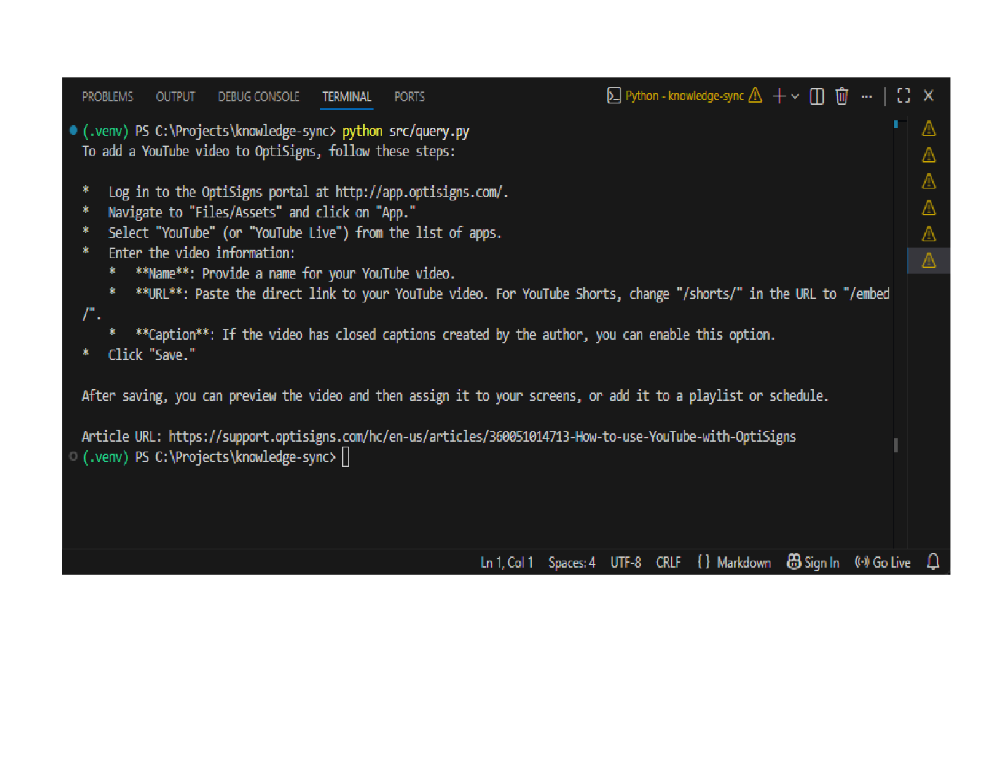

# Knowledge Sync

Scrapes OptiSigns Help Center articles, converts them to clean Markdown, and incrementally synchronizes them with a Gemini File Search Store.

The sync job detects added, updated, and unchanged documents so that only the delta is uploaded.

## Local Setup

```bash
python -m venv .venv
pip install -r requirements.txt
```

Create a `.env` file:

```env
API_KEY=your_api_key_here
GEMINI_FILE_SEARCH_STORE=fileSearchStores/your_store_name
```

Run the synchronization job once:

```bash
python src/main.py
```

Docker:

```bash
docker build -t knowledge-sync .
docker run --rm -e API_KEY=... -e GEMINI_FILE_SEARCH_STORE=... knowledge-sync
```

## Daily Sync Job

The scraper is scheduled to run once per day with GitHub Actions.

[View the latest successful sync job log](https://github.com/ngphuocbao/knowledge-sync/actions/runs/28715319437/job/85155527397)

Example successful run:

```text
Processed: 404
Added    : 1
Updated  : 0
Skipped  : 403
Failed   : 0
```

## Query Result

The assistant successfully answered **"How do I add a YouTube video?"** using the Gemini File Search knowledge base and returned cited OptiSigns article URLs.

